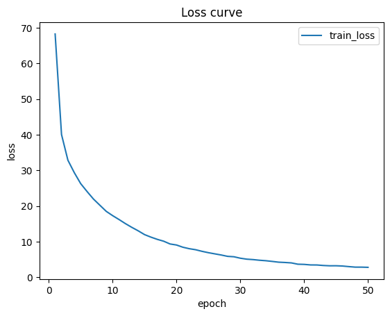
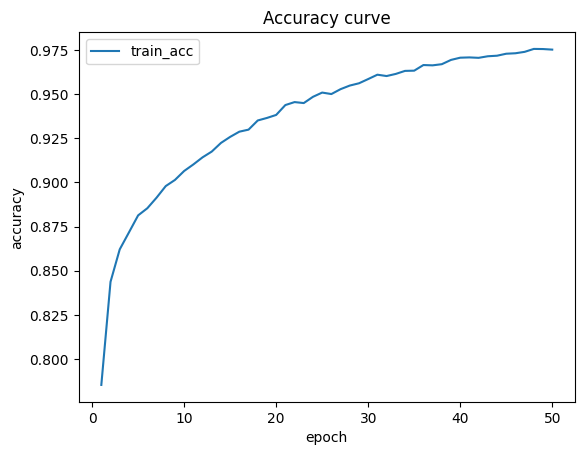
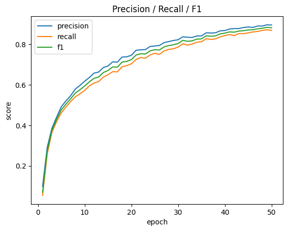

# Named Entity Recognition Implement in Chinese Medical Context

## Motivation

I used to be interested in Natural Language Processing and AI application in the medical field. But I couldn't finish those fantastic projects, so it's a simple implement and luckily I got the data from nowhere(idk).

## Data

### Data Introduction and Overivew
The data includes .txt and .ann. The whole dataset contains 363 pairs of .txt and .ann. I can format part of them. .ann files look like this:

| T_id | Label| Start| End|	Entity Name |
|-----|-----|-----|-----|----|
|T1|	Disease| 1845| 1850|1型糖尿病(Type 1 diabetes)|
|T2|	Disease| 1983|1988|1型糖尿病|
|T4|	Disease| 30| 35|2型糖尿病(Type 1 diabetes)|
| T15   | Test   | 333   | 338| HBA1C|
| T16  | Test   | 344  |348 | 7.5%|
|T17	|Disease |371 |381|	心血管疾病(Cardiovascular disease)|
|T19|	Test_Value| 519| 524	|<6.5%|
|T20|	Test |511| 516|	HBA1C|
|T22|	Disease| 533| 535|	血管(Blood vessels)|

And .txt files look like:

中国成人2型糖尿病HBA1C  c控制目标的专家共识
目前,2型糖尿病及其并发症已经成为危害公众
健康的主要疾病之一,控制血糖是延缓糖尿病进展及
其并发症发生的重要措施之一。
(Expert Consensus on HBA1C c Control Targets for Type 2 Diabetes Mellitus in Chinese Adults.At present, type 2 diabetes mellitus and its complications have become one of the major diseases that jeopardize the health of the public, and glycemic control is one of the most important measures to delay the progression of diabetes mellitus and the occurrence of its complications.)

As you can see, it has a strong medical background, it's lucky to acquire such a quantity of the data.

### Data Processing

However, data processing is required, so the final input data look like this:

|text|	label|	x_len|
|-----|-----|-----|
中国成人2型糖尿病HBA1Cc控制目标的专家共识目前,|	O O O O B-Disease I-Disease I-Disease I-Disease I-Disease B-Test I-Test I-Test I-Test I-Test O O |	75|
重要措施之一。虽然HBA1C。是评价血糖控制水平的公认指标|	O O O O O O O O O B-Test I-Test I-Test I-Test I-Test O O O O B-Test I-Test |	75|
对新诊断的糖尿病患者或病情较轻的患者进|	 O B-Disease I-Disease I-Disease O O O O O O O O O O O|	75|

As you can see, all the terms (I would call them entities in the following text, this is what I did--Named Entity Recognition, so I worked on entities) are annotated as "B-{label}" or "I-{label}". Whether start with B depends it is the first charater or not, and the following characters would be identified as I-{label}. The rest of characters, basically nonsense, so they "O". The method of annotation is called Sequence labeling. You can learn it from [here] (https://arxiv.org/abs/1808.03926). (I am sorry for my informal citation :)

## Model

### Input Layer

Input: a sequence of tokens (characters or words).

Each token is mapped to an embedding using a pretrained BERT model (bert-base-chinese).

Output: contextualized embeddings of shape [seq_len, hidden_dim].

### BiLSTM Layer

A bidirectional LSTM is applied on top of BERT embeddings.

Captures both forward and backward dependencies in the sequence.

Output dimension: [seq_len, 2 * hidden_size].

Note: This layer can be skipped in a pure BERT-CRF setting.

### Linear Layer

Maps the hidden states into the label space.

Output dimension: [seq_len, num_tags].

These are the emission scores for each token and each possible tag.

### CRF Layer (Conditional Random Field)

Models the dependencies between output labels (e.g., B-Disease should be followed by I-Disease, not O).

Training: maximizes the log-likelihood of the correct label sequence.

Inference: uses the Viterbi algorithm to decode the most likely label sequence.

### Workflow

**1. BERT Embeddings**

**Input:** token IDs (integers) of shape [batch_size, seq_len].

**Components:** Word Embeddings: maps each token ID to a dense vector (size 768).

**Position Embeddings:** encodes token positions (max length 512).

**Token Type Embeddings:** distinguishes segments (useful for sentence pairs).

**LayerNorm & Dropout:** normalization and regularization.

**Output: ** contextualized embeddings of shape [batch_size, seq_len, 768].

**2. BERT Encoder (12 Transformer Layers)**

**Input: ** embeddings [batch_size, seq_len, 768].

**Process:** 

Multi-head self-attention (query/key/value projections).

Residual connections + LayerNorm.

Feed-forward (768 → 3072 → 768) with GELU activation.

**Output:** deep contextual representations [batch_size, seq_len, 768].

**3. BERT Pooler (not used for token classification)**

**Input:**  [batch_size, seq_len, 768].

**Process:**  take [CLS] token embedding → Linear → Tanh.

**Note:**  Usually used for sentence classification, not used here.

**4. BiLSTM Layer**

**Input: ** BERT encoder outputs [batch_size, seq_len, 768].

**Process:**

A bidirectional LSTM with hidden size 256.

Forward and backward LSTM capture left and right context.

**Output:**  [batch_size, seq_len, 512] (256 * 2).

**5. Fully Connected (Linear) Layer**

**Input:** BiLSTM outputs [batch_size, seq_len, 512].

**Process:** Linear projection from 512 → 31.

**Output:** [batch_size, seq_len, 31].

Each of the 31 dimensions corresponds to a tag (e.g., B-Disease, I-Disease, O, etc.). This is called the “emission scores.”

**6. CRF Layer (Conditional Random Field)**

**Input:** emission scores [batch_size, seq_len, 31] and transition matrix.

**Process:**

Training: computes the log-likelihood of the correct tag sequence, Loss = negative log-likelihood.

Inference: uses the Viterbi algorithm to decode the most likely tag sequence.

**Output:** predicted label sequences (list of integers, one per token).

### Loss Funciton

The model uses the Conditional Random Field (CRF) loss, also known as negative log-likelihood (NLL) loss.

For a given input sequence x and a label sequence y, the CRF assigns a score:

$$\text{score}(x,y)=\sum_{t=1}^T\left(\text{emission}(t,y_t)+\text{transition}(y_{t-1},y_t)\right)$$

Emission scores come from the Linear layer applied on top of BERT/BiLSTM outputs.

Transition scores are learned parameters modeling dependencies between labels (e.g., `B-Disease` is likely followed by `I-Disease`).

The probability of a sequence is defined as:

$$P(y|x)=\frac{\exp(\mathrm{score}(x,y))}{\sum_{y^{\prime}\in Y}\exp(\mathrm{score}(x,y^{\prime}))}$$

The loss function is the negative log-likelihood:

$$\mathcal{L}(x,y)=-\log P(y|x)$$

## Training

Hyperparameters configuration is `batch_size=50`, `epoch=50`, `learning rate = 1e-3`, and it probably consumed 6 hours on a RTX2060. Too time-consuming so I didn't tune the hyperparameters after training.

## Result

The result of training looks perfect! But in this task, accuraccy is far away from a good evalution (Model can predict all as "O" to get a high accuracy). So we should focus on recall, precision and F1-score.

Unfortunately, it's overfitting and I didn't notice that because I didn't set the validation data set. The result of test looks like this:

| Class       | Precision | Recall | F1-score | Support |
|-------------|-----------|--------|----------|---------|
| Amount      | 0.59      | 0.29   | 0.39     | 58      |
| Anatomy     | 0.51      | 0.49   | 0.50     | 604     |
| Disease     | 0.61      | 0.74   | 0.67     | 1383    |
| Drug        | 0.77      | 0.64   | 0.70     | 1408    |
| Duration    | 0.24      | 0.20   | 0.22     | 40      |
| Frequency   | 1.00      | 0.05   | 0.09     | 21      |
| Level       | 0.41      | 0.27   | 0.33     | 126     |
| Method      | 0.36      | 0.12   | 0.18     | 75      |
| Operation   | 0.64      | 0.12   | 0.20     | 60      |
| Reason      | 0.25      | 0.23   | 0.24     | 176     |
| SideEff     | 0.04      | 0.01   | 0.02     | 102     |
| Symptom     | 0.31      | 0.34   | 0.32     | 313     |
| Test        | 0.61      | 0.72   | 0.66     | 1540    |
| Test_Value  | 0.45      | 0.36   | 0.40     | 442     |
| Treatment   | 0.12      | 0.12   | 0.12     | 48      |
| **micro avg**   | 0.58 | 0.58   | 0.58     | 6396    |
| **macro avg**   | 0.46 | 0.31   | 0.34     | 6396    |
| **weighted avg**| 0.58 | 0.58   | 0.57     | 6396    |

In the classification report, the support column indicates the number of true instances for each class in the evaluation dataset.

It tells us how many samples of each class are present in the ground truth. Larger support values mean the reported precision/recall/F1 are more reliable. Classes with very small support (e.g., less than 50) may show unstable or misleading scores, since a few misclassifications can dramatically change the metrics.

From the table, we can observe that it's overfitted generally, but more importantlt, I should use some data augmentation or sample methods to solve that less than 50 support in some labels.

## Conclusion

It's a great opportunity to experience the whole pipeline of deep-learning frame. Besides the medical context also make this classification task really cool. I did learned some fantastic theories like CRF method and its loss function. More importantly, I am familiar with Pytorch.  Hopefully it would be helpful for my master's thesis and reserach project in the near future. Gook luck to myself :)
